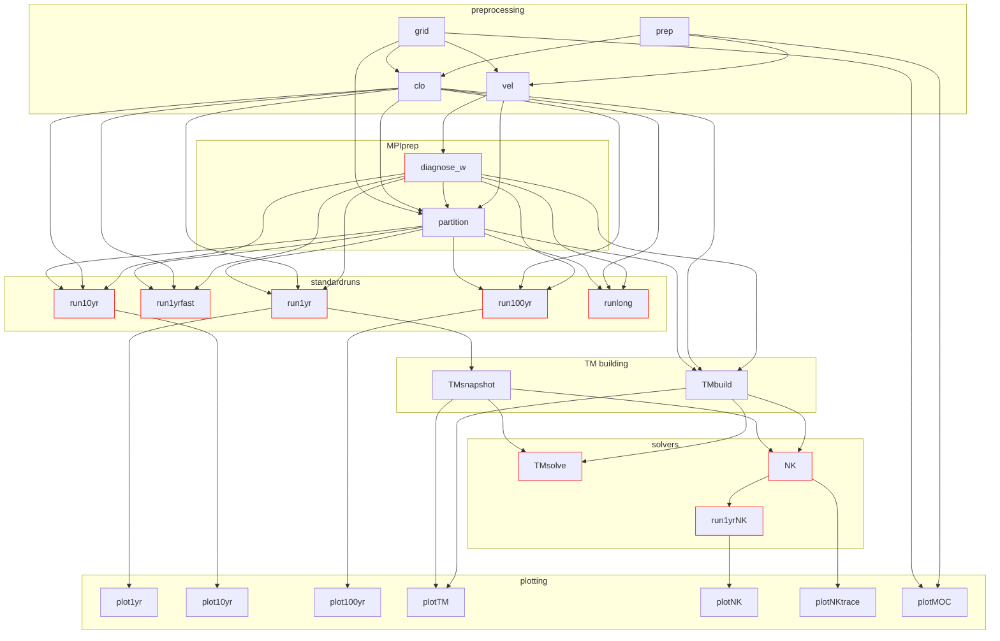

# ACCESS-OM2_x_Oceananigans

Trying to "couple" Oceananigans for time-stepping an offline surrogate of ACCESS-OM2 and then
use transport matrices to solve for periodic state using a Newon–Krylov solver.

🚧 This is exploratory WIP and may be abandonned any time!

## Pipeline

The full pipeline is managed by a unified `scripts/driver.sh` that submits chained PBS jobs with `afterok` dependencies. All scripts are model-agnostic — `PARENT_MODEL` selects the model. Run from the login node:

```bash
# Run the full ACCESS-OM2-1 pipeline (default experiment and time window)
JOB_CHAIN=full bash scripts/driver.sh

# Run the full ACCESS-OM2-025 pipeline
PARENT_MODEL=ACCESS-OM2-025 JOB_CHAIN=full bash scripts/driver.sh

# Specify experiment and time window
EXPERIMENT=1deg_jra55_ryf9091_gadi TIME_WINDOW=1958-1987 JOB_CHAIN=full bash scripts/driver.sh
```

### Dependency DAG

<!-- Source of truth: scripts/pipeline.mmd -->


### Selecting steps with `JOB_CHAIN`

Use the `JOB_CHAIN` env var to run only a subset of the pipeline. Steps not in the chain are skipped (their outputs are assumed to already exist). `JOB_CHAIN` is required — the driver prints usage help if not set.

**Steps** (topological order):
`prep grid vel run1yr run10yr run100yr runlong TMbuild TMsnapshot TMsolve NK run1yrNK plotNK plotNKtrace plot1yr plot10yr plot100yr`

**Shortcuts:**
| Shortcut | Expands to |
|---|---|
| `preprocessing` | `prep-grid-vel` |
| `standardruns` | `run1yr-run10yr-run100yr-runlong` |
| `TMall` | `TMbuild-TMsnapshot-TMsolve` |
| `plotall` | `plot1yr-plot10yr-plot100yr-plotNK` |
| `full` | `preprocessing-run1yr-TMall-NK-run1yrNK-plotNK-plot1yr` |

**Range notation:** `A..B` expands to all steps on any path from A to B in the dependency DAG — not a flat list.

```bash
# Only run Newton-GMRES solves (matrices must already exist)
JOB_CHAIN=NK bash scripts/driver.sh

# Run 1-year simulation and plot
JOB_CHAIN=run1yr-plot1yr bash scripts/driver.sh

# Build matrices and run all solvers
JOB_CHAIN=run1yr-TMall-NK bash scripts/driver.sh

# Everything from vel to NK (range follows the DAG, excludes run10yr/runlong/TMsolve)
JOB_CHAIN=vel..NK bash scripts/driver.sh

# Re-run + plot from NK solution (range follows NK→run1yrNK→plotNK path only)
JOB_CHAIN=run1yrNK..plotNK bash scripts/driver.sh

# Run both const and avg branches
TM_SOURCE=both JOB_CHAIN=NK-run1yrNK-plotNK bash scripts/driver.sh

# Run preprocessing only
JOB_CHAIN=preprocessing bash scripts/driver.sh

# Specify experiment and time window
EXPERIMENT=1deg_jra55_ryf9091_gadi TIME_WINDOW=1958-1987 JOB_CHAIN=full bash scripts/driver.sh

# ACCESS-OM2-025 with specific GPU queue
PARENT_MODEL=ACCESS-OM2-025 GPU_RESOURCES=gpuvolta JOB_CHAIN=run1yr bash scripts/driver.sh
```

### TM_SOURCE filtering

`TM_SOURCE` controls which transport matrix branch is used for `TMsolve`, `NK`, and `run1yrNK`:

| Value | Description |
|-------|-------------|
| `const` (default) | Only const-field matrices (from `TMbuild`) |
| `avg` | Only time-averaged snapshot matrices (from `TMsnapshot`) |
| `both` | Both branches in parallel |

### GPU preprocessing with `PREPROCESS_ARCH`

Velocity creation can run on GPU for faster processing (grid creation and Python `prep` always run on CPU):

```bash
# Run velocities on GPU
PREPROCESS_ARCH=GPU JOB_CHAIN=preprocessing bash scripts/driver.sh
```

### Model configs

Model-specific settings (walltimes, PBS name prefix) live in `model_configs/`:
- `model_configs/ACCESS-OM2-1.sh`
- `model_configs/ACCESS-OM2-025.sh`

### Script organisation

```
scripts/
├── driver.sh                  # Unified pipeline entry point
├── test_driver.sh             # Test/diagnostic driver (halofill, diag, mpi)
├── env_defaults.sh            # Common env var defaults
├── prepreprocessing/          # Python preprocessing (periodicaverage.py PBS wrapper)
├── preprocessing/             # Grid, velocities, transport matrices
├── standard_runs/             # Age simulations (1yr, 10yr, 100yr, long, benchmark)
├── solvers/                   # Newton-Krylov + TM age solvers
├── plotting/                  # Diagnostic plots + architecture comparison
├── tests/                     # Test PBS wrappers (halofill, diag, mpi)
├── benchmarks/                # Parameter sweep submitters
├── maintenance/               # Package management, MPI setup, archiving
└── debugging/                 # Debug/check scripts
```

## Multi-GPU (MPI) runs

Multi-GPU simulations use MPI to distribute the grid across GPUs. All PBS scripts automatically detect `NGPUS > 1` and launch via `mpiexec`.

**Socket binding on Gadi:** Gadi assigns MPI ranks to CPU sockets randomly by default. Since each GPU is physically attached to a specific CPU socket, this can result in a CPU communicating with a GPU on a different socket, causing severe CPU-GPU transfer slowdowns. All scripts use `--bind-to socket --map-by socket` to pin each MPI rank to the socket directly connected to its GPU.

GPU partition is set via `GPU_RESOURCES`:
```bash
# 2x2 partition (4 GPUs) on Volta
GPU_RESOURCES=gpuvolta-2x2 JOB_CHAIN=run1yr bash scripts/driver.sh

# 1x2 slab partition (2 GPUs) on Hopper
GPU_RESOURCES=gpuhopper-1x2 JOB_CHAIN=run1yr bash scripts/driver.sh
```

## GitHub CLI (`gh`)

To use the `gh` CLI on Gadi, load the module first:
```bash
module use /g/data/vk83/modules
module load system-tools/gh
```

## Project setup notes

Gadi compute nodes don't have access to the internet, so the project dependencies must be downloaded on the login node. But the default multi-threaded precompilation could use too much resources and crash during `pkg> up`. Instead, run the dedicated script `scripts/maintenance/pkg_update_project.sh`, which runs `pkg> up` on the login node _without_ precompilation, then submits precompilation on compute nodes on the CPU and then on the GPU.

## Configuration

Simulations are configured via environment variables.

### Experiment and time window

| Variable | Default | Description |
|----------|---------|-------------|
| `EXPERIMENT` | `1deg_jra55_iaf_omip2_cycle6` (OM2-1) or `025deg_jra55_iaf_omip2_cycle6` (OM2-025) | Intake catalog key for ACCESS-OM2 experiment |
| `TIME_WINDOW` | `1960-1979` | Year range `YYYY-YYYY` or single year `YYYY` |

These determine the input data source and the directory structure for preprocessed inputs, outputs, and logs.

### Model config

The 4 core config variables determine the model setup and output directory paths:

| Variable | Valid values | Default | Description |
|----------|-------------|---------|-------------|
| `VELOCITY_SOURCE` | `cgridtransports`, `bgridvelocities` | `cgridtransports` | Source of prescribed velocities |
| `W_FORMULATION` | `wdiagnosed`, `wprescribed` | `wdiagnosed` | Vertical velocity treatment |
| `ADVECTION_SCHEME` | `centered2`, `weno3`, `weno5` | `centered2` | Tracer advection scheme |
| `TIMESTEPPER` | `AB2`, `SRK2`, `SRK3`, `SRK4`, `SRK5` | `AB2` | Time-stepping scheme |

Timestepper values map to Oceananigans symbols:
- `AB2` = `:QuasiAdamsBashforth2` (default quasi-Adams-Bashforth 2nd order)
- `SRK{N}` = `:SplitRungeKutta{N}` (split Runge-Kutta with N = 2..5 stages)

The combined tag `MODEL_CONFIG = {VS}_{WF}_{AS}_{TS}` (e.g. `cgridtransports_wdiagnosed_centered2_AB2`) determines output directory paths and log filenames.

### Solver-specific variables

These configure the fixed-point acceleration solvers in `solve_periodic_AA.jl` (archived):

| Variable | Default | Description |
|----------|---------|-------------|
| `AA_M` | `40` | Anderson history size (used by NLsolve, SIAMFANL, FixedPoint) |
| `NLSAA_BETA` | `1.0` | Anderson damping parameter (try 0.5 for slow convergence) |
| `SMAA_SIGMA_MIN` | `0.0` | SpeedMapping minimum σ; setting to 1 may avoid stalling |
| `SMAA_STABILIZE` | `no` | Stabilization mapping before extrapolation (`yes`/`no`) |
| `SMAA_CHECK_OBJ` | `no` | Restart at best past iterate on NaN/Inf (`yes`/`no`) |
| `SMAA_ORDERS` | `332` | Alternating order sequence (each digit 1–3) |

Shell defaults are set in `scripts/env_defaults.sh`, which is sourced by all PBS job scripts. Override at submission time:

```bash
qsub -v TIMESTEPPER=SRK3,ADVECTION_SCHEME=weno5 scripts/standard_runs/run_1year.sh
```

## Tests

Test/diagnostic jobs are managed by a separate `scripts/test_driver.sh` (independent from the production `driver.sh`). Available test steps:

| Step | Description |
|------|-------------|
| `halofill` | MWE testing `fill_halo_regions!` at all staggered locations on distributed tripolar grids |
| `diag` | 10-step diagnostic run saving age at every time step (for serial vs distributed comparison) |
| `mpi` | MPI smoke test (rank/device info, 10-iteration simulation) |

```bash
# Run halo fill test on 4 GPUs (2x2 partition)
GPU_RESOURCES=gpuvolta-2x2 PARENT_MODEL=ACCESS-OM2-1 JOB_CHAIN=halofill bash scripts/test_driver.sh

# Run diagnostic steps (serial baseline)
PARENT_MODEL=ACCESS-OM2-1 JOB_CHAIN=diag bash scripts/test_driver.sh

# Run diagnostic steps (distributed 2x2)
GPU_RESOURCES=gpuvolta-2x2 PARENT_MODEL=ACCESS-OM2-1 JOB_CHAIN=diag bash scripts/test_driver.sh

# Run all tests at once
GPU_RESOURCES=gpuvolta-2x2 PARENT_MODEL=ACCESS-OM2-1 JOB_CHAIN=halofill-diag-mpi bash scripts/test_driver.sh
```

### Comparing serial vs distributed output

After both serial and distributed `diag` jobs complete, compare step-by-step:

```bash
GPU_TAG=2x2 DURATION_TAG=diag PARENT_MODEL=ACCESS-OM2-1 \
  qsub scripts/plotting/compare_runs_across_architectures.sh
```

This prints a per-step volume-weighted RMS norm table and generates diagnostic plots.
The same script works for 1-year runs (`DURATION_TAG=1year`).

### Matrix regression tests

Julia test scripts for matrix regression live in `test/`. To run the regression test comparing newly-built snapshot matrices against archived reference matrices:

```bash
qsub scripts/debugging/check_snapshot_matrices_job.sh
```

## Preprocessed outputs layout

Preprocessing writes data and images under:

`preprocessed_inputs/<PARENT_MODEL>/<EXPERIMENT>/`

Grid file (shared across time windows):

- `grid.jld2`

Per-time-window data files under `<TIME_WINDOW>/monthly/` and `<TIME_WINDOW>/yearly/`:

- `u_interpolated_monthly.jld2` / `u_interpolated_yearly.jld2`
- `v_interpolated_monthly.jld2` / `v_interpolated_yearly.jld2`
- `w_monthly.jld2` / `w_yearly.jld2`
- `eta_monthly.jld2` / `eta_yearly.jld2`
- `u_from_mass_transport_monthly.jld2` / `u_from_mass_transport_yearly.jld2`
- `v_from_mass_transport_monthly.jld2` / `v_from_mass_transport_yearly.jld2`
- `w_from_mass_transport_monthly.jld2` / `w_from_mass_transport_yearly.jld2`

NetCDF climatologies from `periodicaverage.py`:

- `<TIME_WINDOW>/monthly/*_monthly.nc`
- `<TIME_WINDOW>/yearly/*_yearly.nc`

Plots are colocated under:

`preprocessed_inputs/<PARENT_MODEL>/<EXPERIMENT>/<TIME_WINDOW>/monthly/plots/`

with subdirectories for each plotted field family:

- `u/` (original B-grid `u`)
- `v/` (original B-grid `v`)
- `u_interpolated/`
- `v_interpolated/`
- `w/`
- `eta/`
- `u_from_mass_transport/`
- `v_from_mass_transport/`
- `w_from_mass_transport/`

Each plot subdirectory is split by vertical level (`k<level>` when applicable). Each image contains one field only.
